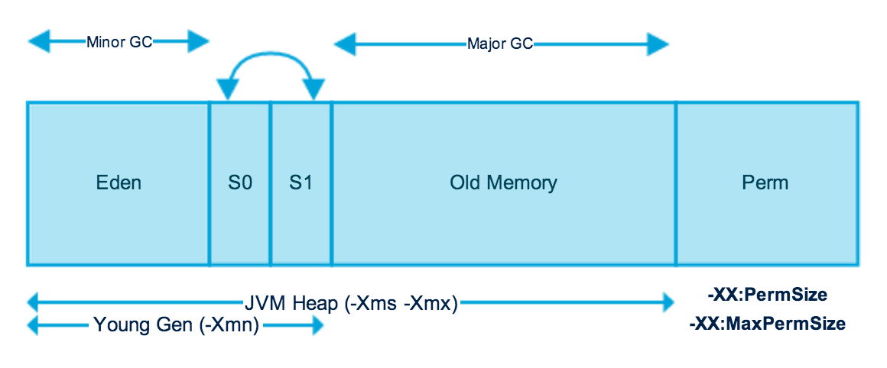
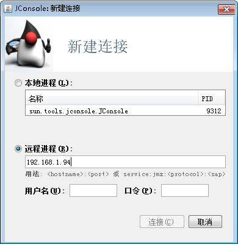
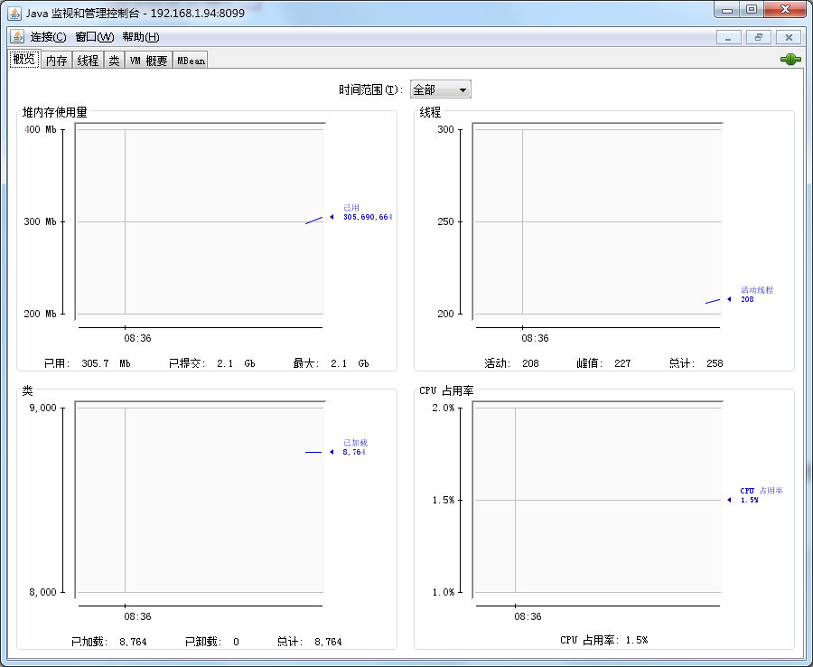

# JVM调优

## 1.比较有用的网页
* [JVM内幕：Java虚拟机详解](http://www.importnew.com/17770.html)

* [Java内存与垃圾回收调优](http://www.importnew.com/14086.html)

* [Tomcat中JVM内存溢出及合理配置](https://blog.csdn.net/ye1992/article/details/9344807)


## 2.JAVA虚拟机内存结构


```
Stack(栈):存储线程运行的局部变量及对象的引用
Heap (堆):对象的实例
eg：Persion p = new Persion
new Persion存放堆&p存放在栈
Non Heap：常量
```

## 3.Java（JVM）内存模型




* 年轻代
```
年轻代是所有新对象产生的地方。当年轻代内存空间被用完时，就会触发垃圾回收。这个垃圾回收叫做Minor GC。年轻代被分为3个部分——Enden区和两个Survivor区。

年轻代空间的要点：

大多数新建的对象都位于Eden区。
当Eden区被对象填满时，就会执行Minor GC。并把所有存活下来的对象转移到其中一个survivor区。
Minor GC同样会检查存活下来的对象，并把它们转移到另一个survivor区。这样在一段时间内，总会有一个空的survivor区。
经过多次GC周期后，仍然存活下来的对象会被转移到年老代内存空间。通常这是在年轻代有资格提升到年老代前通过设定年龄阈值来完成的。
```

* 老年代
```
年老代内存里包含了长期存活的对象和经过多次Minor GC后依然存活下来的对象。通常会在老年代内存被占满时进行垃圾回收。老年代的垃圾收集叫做Major GC。Major GC会花费更多的时间。
```

* Stop the World事件
```
所有的垃圾收集都是“Stop the World”事件，因为所有的应用线程都会停下来直到操作完成（所以叫“Stop the World”）。

因为年轻代里的对象都是一些临时（short-lived ）对象，执行Minor GC非常快，所以应用不会受到（“Stop the World”）影响。

由于Major GC会检查所有存活的对象，因此会花费更长的时间。应该尽量减少Major GC。因为Major GC会在垃圾回收期间让你的应用反应迟钝，所以如果你有一个需要快速响应的应用发生多次Major GC，你会看到超时错误。

垃圾回收时间取决于垃圾回收策略。这就是为什么有必要去监控垃圾收集和对垃圾收集进行调优。从而避免要求快速响应的应用出现超时错误。
```

* 永久代
```
永久代或者“Perm Gen”包含了JVM需要的应用元数据，这些元数据描述了在应用里使用的类和方法。注意，永久代不是Java堆内存的一部分。

永久代存放JVM运行时使用的类。永久代同样包含了Java SE库的类和方法。永久代的对象在full GC时进行垃圾收集。
```

## 4.Java 堆内存开关

| 名称            | 说明                                                                              |
|-----------------|-----------------------------------------------------------------------------------|
| -Xmx            | Java Heap最大值，默认值为物理内存的1/4                                             |
| -Xms            | Java Heap初始值，Server端JVM最好将-Xms和-Xmx设为相同值，开发测试机JVM可以保留默认值 |
| -Xmn            | Java Heap Young区大小，不熟悉最好保留默认值                                        |
| -Xss            | 每个线程的Stack大小，不熟悉最好保留默认值                                          |
| -XX:PermSize    | 设定内存的永久保存区域                                                            |
| -XX:MaxPermSize | 设定最大内存的永久保存区域                                                        |
| -XX:PermSize    | 设定内存的永久保存区域                                                            |
| -XX:NewSize     | 设置JVM堆的‘新生代’的默认大小                                                     |
| -XX:MaxNewSize  | 设置JVM堆的‘新生代’的最大大小                                                     |


## 5.Jconsol监控JAVA虚拟堆栈使用情况

* 在tomcat目录下catalina.sh文件中添加
```
JAVA_OPTS="-Djava.rmi.server.hostname=127.0.0.1 -Dcom.sun.management.jmxremote.port=8099 -Dcom.sun.management.jmxremote.rmi.port=8099 -Dcom.sun.management.jmxremote.ssl=false -Dcom.sun.management.jmxremote.authenticate=false"  
```
```
PS:其中127.0.0.1一定要改成本机物理IP地址不能使用127.0.0.1
如果 -Dcom.sun.management.jmxremote.authenticate设置为false则不需要输入用户和密码
```

* 在JDK中打开Jconsol \JDK\jdk1.7.0_67\bin


