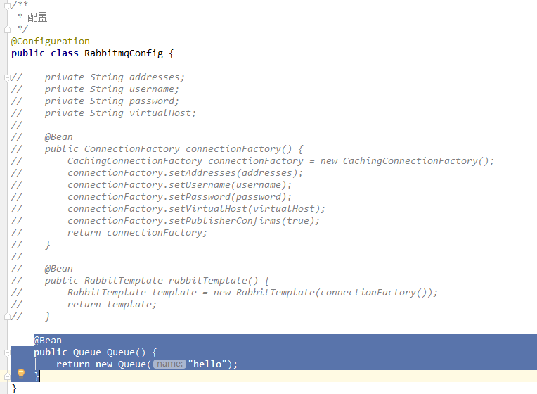
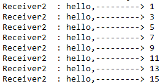
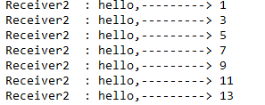

# 1.这个是一个普通的工作模式demo
## 1.1导包，后面的demo就不写了
```
<dependency>
    <groupId>org.springframework.boot</groupId>
     <artifactId>spring-boot-starter-amqp</artifactId>
</dependency>
```
## 1.2写配置
```
abbitmq:
      addresses: 192.168.1.178:5672,192.168.1.178:5673,192.168.1.178:5675 #这里需要注意，使用了docker上搭建集群的地址和端口
      username: admin
      password: 888888
      publisher-confirms: true
      virtual-host: /
```
# 2.Rabbitmq配置类，根据自己的工程灵活配置,在这里配置队列名


# 3.消息生产者
```
import org.springframework.amqp.core.AmqpTemplate;
import org.springframework.beans.factory.annotation.Autowired;
import org.springframework.stereotype.Component;

import java.util.Date;

@Component
public class Sender {
    @Autowired
    private AmqpTemplate rabbitTemplate;
    public void send() {
        for (int i=0;i<100;i++){
            String context = "hello,---------> " + i;
            System.out.println("Sender : " + context);
            this.rabbitTemplate.convertAndSend("hello", context);
        }

    }
}

```
#  4.消息消费者1和消息消费者2
消息消费者1
```
import org.springframework.amqp.rabbit.annotation.RabbitHandler;
import org.springframework.amqp.rabbit.annotation.RabbitListener;
import org.springframework.stereotype.Component;

@Component
@RabbitListener(queues = "hello")
public class Receiver1 {
    @RabbitHandler
    public void process(String hello) {
        System.out.println("Receiver1  : " + hello);
    }
}
```
消息消费者2
```
@Component
@RabbitListener(queues = "hello")
public class Receiver1 {
    @RabbitHandler
    public void process(String hello) {
        System.out.println("Receiver2  : " + hello);
    }
}
```

# 5.测试
```
@RunWith(SpringRunner.class)
@SpringBootTest
public class RabbitTest {

    @Autowired
    Sender sender;
    @Test
    public void hello() throws Exception {
        sender.send();
    }
}
```



# 普通work模式总结
* 同一个队列的消息消费者将会均匀得到消息