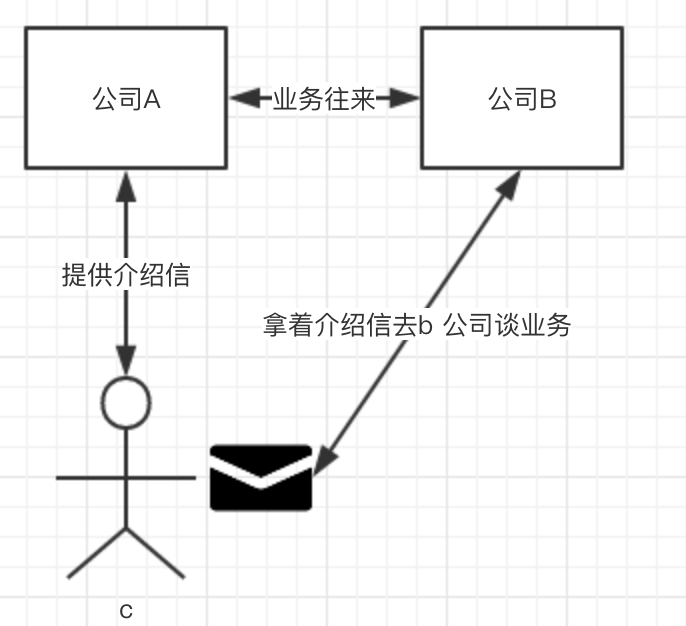
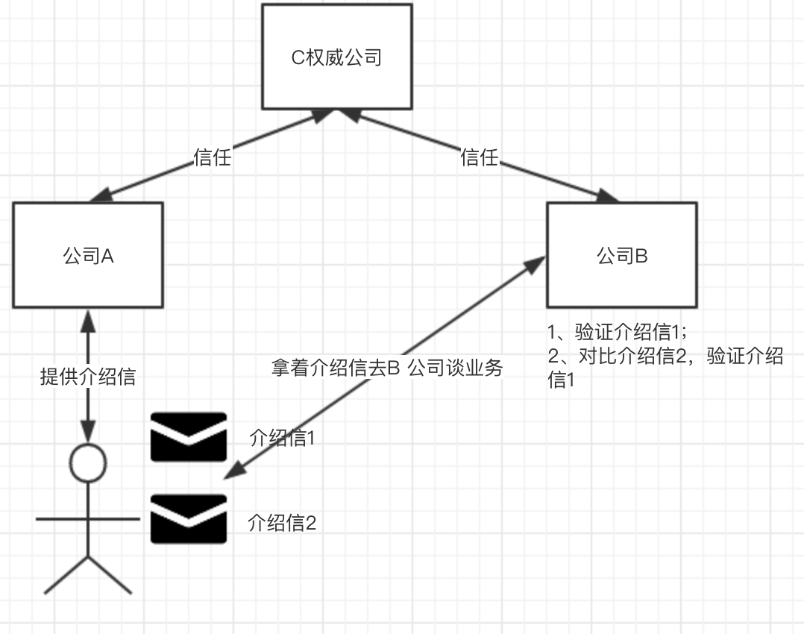

# CA证书基础知识

## 引子-介绍信

### 普通的介绍信

  

假设 A 公司的张三先生要到 B 公司去拜访，但是 B 公司的所有人都不认识他，他咋办捏？常用的办法是带公司开的一张介绍信，在信中说：兹有张三先生前往贵公司办理业务，请给予接洽......云云。然后在信上敲上A公司的公章。   
张三先生到了 B 公司后，把介绍信递给 B 公司的前台李四小姐。李小姐一看介绍信上有 A 公司的公章，而且 A 公司是经常和 B 公司有业务往来的，这位李小姐就相信张先生不是歹人了。这里，A公司就是CA证书

### 引入中介机构的介绍信  

如果和 B 公司有业务往来的公司很多，每个公司的公章都不同，那前台就要懂得分辨各种公章，非常滴麻烦。所以，有某个中介公司 C，发现了这个商机。C公司专门开设了一项“代理公章”的业务。今后，A 公司的业务员去 B 公司，需要带2个介绍信：  

* 介绍信1,含有 C 公司的公章及 A 公司的公章。并且特地注明：C 公司信任 A 公司。
* 介绍信2,仅含有 A 公司的公章，然后写上：兹有张三先生前往贵公司办理业务，请给予接洽......。

某些不开窍的同学会问了，这样不是增加麻烦了吗？有啥好处捏？

主要的好处在于，对于接待公司的前台，就不需要记住各个公司的公章分别是啥样子的；他/她只要记住中介公司 C 的公章即可。当他/她拿到两份介绍信之后，先对介绍信1的 C 公章，验明正身；确认无误之后，再比对介绍信1和介绍信2的两个 A 公章是否一致。如果是一样的，那就可以证明介绍信2是可以信任的了。

## 什么是证书？

* 名词解释

    * “证书”洋文也叫“digital certificate”或“public key certificate”（专业的解释看“这里”）。

    * 它是用来证明某某东西确实是某某东西的东西（是不是像绕口令？）。通俗地说，证书就好比例子里面的公章。通过公章，可以证明该介绍信确实是对应的公司发出的。

    * 理论上，人人都可以找个证书工具，自己做一个证书。那如何防止坏人自己制作证书出来骗人捏？请看后续 CA 的介绍。

* 什么是CA？ 

    * CA是Certificate Authority的缩写，也叫“证书授权中心”。（专业的解释看“这里”）

    * 它是负责管理和签发证书的第三方机构，就好比例子里面的中介——C 公司。一般来说，CA必须是所有行业和所有公众都信任的、认可的。因此它必须具有足够的权威性。就好比A、B两公司都必须信任C公司，才会找 C 公司作为公章的中介。

* 什么是CA证书？

    * CA 证书，顾名思义，就是CA颁发的证书。

    * 前面已经说了，人人都可以找工具制作证书。但是你一个小破孩制作出来的证书是没啥用处的。因为你不是权威的CA机关，你自己搞的证书不具有权威性。

    * 这就好比上述的例子里，某个坏人自己刻了一个公章，盖到介绍信上。但是别人一看，不是受信任的中介公司的公章，就不予理睬。坏蛋的阴谋就不能得逞啦。

    * 文本后续提及的证书，若无特殊说明，均指 CA 证书。

## 证书的签发过程

* 服务方 S 向第三方机构CA提交公钥、组织信息、个人信息(域名)等信息并申请认证；

* CA 通过线上、线下等多种手段验证申请者提供信息的真实性，如组织是否存在、企业是否合法，是否拥有域名的所有权等；

* 如信息审核通过，CA 会向申请者签发认证文件-证书。
    * 证书包含以下信息：申请者公钥、申请者的组织信息和个人信息、签发机构 CA 的信息、有效时间、证书序列号等信息的明文，同时包含一个签名；
    * 签名的产生算法：首先，使用散列函数计算公开的明文信息的信息摘要，然后，采用 CA 的私钥对信息摘要进行加密，密文即签名；

* 客户端 C 向服务器 S 发出请求时，S 返回证书文件；

* 客户端 C 读取证书中的相关的明文信息，采用相同的散列函数计算得到信息摘要，然后，利用对应 CA 的公钥解密签名数据，对比证书的信息摘要，如果一致，则可以确认证书的合法性，即公钥合法；

* 客户端然后验证证书相关的域名信息、有效时间等信息；

* 客户端会内置信任 CA 的证书信息(包含公钥)，如果CA不被信任，则找不到对应 CA 的证书，证书也会被判定非法。

> 在这个过程注意几点：
> 1.申请证书不需要提供私钥，确保私钥永远只能服务器掌握；
> 2.证书的合法性仍然依赖于非对称加密算法，证书主要是增加了服务器信息以及签名；
> 3.内置 CA 对应的证书称为根证书，颁发者和使用者相同，自己为自己签名，即自签名证书；
> 4.证书=公钥+申请者与颁发者信息+签名；

## https 

### 解决问题

* 防监听，数据是加密的，所以监听得到的数据是密文，hacker看不懂。
* 防伪装，伪装分为客户端伪装和服务器伪装，通信双方携带证书，证书相当于身份证，有证书就认为合法，没有证书就认为非法，证书由第三方颁布，很难伪造
* 防篡改，https对数据做了摘要，篡改数据会被感知到。hacker即使从中改了数据也白搭。

### https连接过程

* 客户端发送请求到服务器端
* 服务器端返回证书和公开密钥，公开密钥作为证书的一部分而存在
* 客户端验证证书和公开密钥的有效性，如果有效，则生成共享密钥并使用公开密钥加密发送到服务器端
* 服务器端使用私有密钥解密数据，并使用收到的共享密钥加密数据，发送到客户端
* 客户端使用共享密钥解密数据
* SSL加密建立………