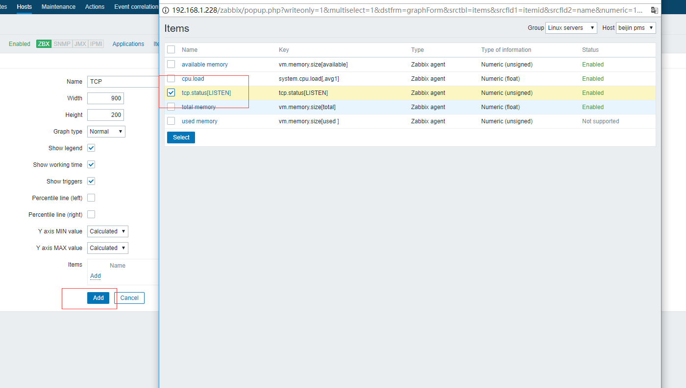

# 配置自定义数据 {ignore=true}


<!-- @import "[TOC]" {cmd="toc" depthFrom=1 depthTo=6 orderedList=false} -->
<!-- code_chunk_output -->

* [使用场景](#使用场景)
* [原理](#原理)
* [设置agent](#设置agent)
	* [设置本地脚本](#设置本地脚本)
	* [配置agent](#配置agent)
* [设置server](#设置server)
	* [测试客户端设置](#测试客户端设置)
	* [配置item](#配置item)
	* [添加图片](#添加图片)
* [完成效果图](#完成效果图)

<!-- /code_chunk_output -->


## 使用场景


经常我们有zabbix未定义的数据需要监控在此情况下，我们需要自定义一些数据，本文以监听TCP端口有多少个客户端链接为示例。

## 原理

ZABBIX SERVER -> ZABBIX AGENT -> 自定义shell脚本

## 设置agent


### 设置本地脚本

``/usr/local/zabbix/scripts/tcp_status.sh``

```
#!/bin/bash
#xiaoluo
#scripts for tcp status
function SYNRECV {
/usr/sbin/ss -ant | awk '{++s[$1]} END {for(k in s) print k,s[k]}' | grep 'SYN-RECV' | awk '{print $2}'
}
function ESTAB {
/usr/sbin/ss -ant | awk '{++s[$1]} END {for(k in s) print k,s[k]}' | grep 'ESTAB' | awk '{print $2}'
}
function FINWAIT1 {
/usr/sbin/ss -ant | awk '{++s[$1]} END {for(k in s) print k,s[k]}' | grep 'FIN-WAIT-1' | awk '{print $2}'
}
function FINWAIT2 {
/usr/sbin/ss -ant | awk '{++s[$1]} END {for(k in s) print k,s[k]}' | grep 'FIN-WAIT-2' | awk '{print $2}'
}
function TIMEWAIT {
/usr/sbin/ss -ant | awk '{++s[$1]} END {for(k in s) print k,s[k]}' | grep 'TIME-WAIT' | awk '{print $2}'
}
function LASTACK {
/usr/sbin/ss -ant | awk '{++s[$1]} END {for(k in s) print k,s[k]}' | grep 'LAST-ACK' | awk '{print $2}'
}
function LISTEN {
/usr/sbin/ss -ant | awk '{++s[$1]} END {for(k in s) print k,s[k]}' | grep 'LISTEN' | awk '{print $2}'
}
$1
```
修改权限，``chmod o+x /usr/local/zabbix/scripts/tcp_status.sh``


### 配置agent 

``vim /etc/zabbix/zabbix_agentd.d/tcp-status-params.conf``

```
UserParameter=tcp.status[*],/usr/local/zabbix/scripts/tcp_status.sh $1
```
注意：tcp.status，是未来在server上配置的配置key.

## 设置server

### 测试客户端设置

使用如下测试命令，测试调试设置是否OK。
```
zabbix_get -s 192.168.1.239 -p 10050 -k "tcp.status[LISTEN]"
```
注：如果zabbix_get未安装，则使用``yum install zabbix-get.x86_64``安装；IP和端口根据实际情况填写；

### 配置item

* configuration -> hosts 
* 点击对应host的item


* 点击create item;
* 填写name以及key(参考``vim /etc/zabbix/zabbix_agentd.d/tcp-status-params.conf``文件,的tcp.status)
* 填写其他信息点击add。


### 添加图片

* 添加一个连接的graph

* 在该图标中加上我们刚才加的ITEM；




## 完成效果图

